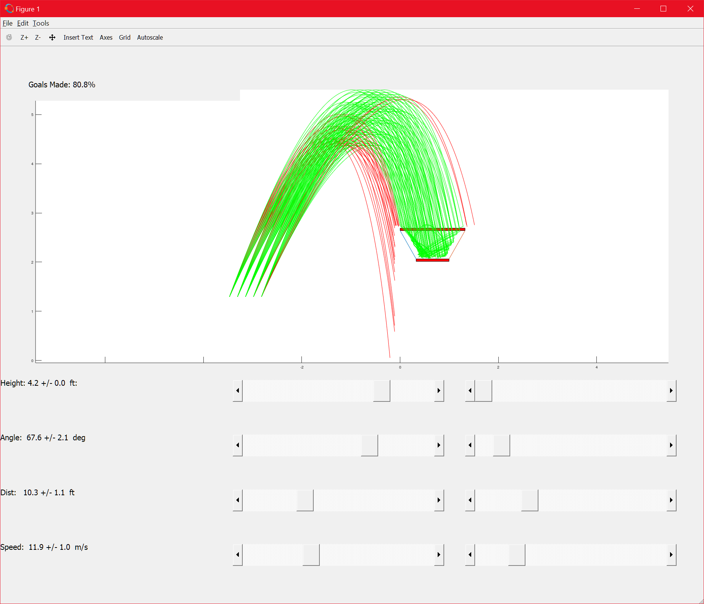

# FRC 2022 Game Simulation Tools

## calc.m

Simulates multiple scenarios for ball trajectories over different ranges of inputs. Useful for helping drive requirements for Cargo launcher designs.

Tested against [GNU Octave](https://www.gnu.org/software/octave/download)

